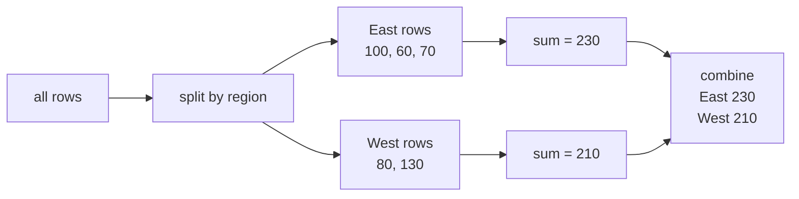

# GroupBy

!!! intuition "The gist"
    GroupBy answers "per category" questions like "total revenue **per region**". It works in three steps: **split** the rows into groups, **apply** a calculation to each group, and **combine** the answers into one result. This is the split-apply-combine pattern.

## Why it exists

"What is the average salary per department?", "total sales per region per month?" In plain Python these need nested loops and extra tracking code. GroupBy does the whole thing in one line, fast, because the looping happens in C. Here is a small sales table.

```python
import pandas as pd

sales = pd.DataFrame({
    "region":  ["East", "East", "West", "West", "East"],
    "product": ["A", "B", "A", "B", "A"],
    "units":   [10, 5, 8, 12, 7],
    "revenue": [100, 60, 80, 130, 70],
})

sales.groupby("region")["revenue"].sum()
# region
# East    230
# West    210
```

## Picture it: split, apply, combine



The rows are partitioned by `region`, each partition is summed, and the sums are stacked back into one result. Every GroupBy follows this shape.

**In one line:** split the rows by a key, run a calculation per group, combine the answers.

## How it works

### Group, then aggregate

`groupby` on its own computes nothing. It returns a lazy GroupBy object; the work happens when you call an aggregation.

```python
sales.groupby("region")["revenue"].sum()    # one number per region
sales.groupby("region")["units"].mean()     # average units per region
sales.groupby(["region", "product"]).sum()  # group by two keys at once
```

Grouping by two columns gives a result per *combination*, here per (region, product) pair.

### The common aggregations

`sum`, `mean`, `median`, `min`, `max`, `count`, `size`, `std`, `nunique`, `first`, `last`. All run in fast C code, so prefer them over hand-written functions.

### Keep the key as a column

By default the group key becomes the index. To keep it as a regular column, use `as_index=False` (or `reset_index` afterward, from [resetting the index](../indexing/reset-index.md)).

```python
sales.groupby("region", as_index=False)["revenue"].sum()
#   region  revenue
# 0   East      230
# 1   West      210
```

??? question "Quick check: predict the groups"
    `sales` has three East rows with revenue 100, 60, 70. What does `sales.groupby("region")["revenue"].sum()` give for East?

    **Answer:** **230**. GroupBy splits out the three East rows, sums their revenue (100 + 60 + 70), and reports one value for the East group.

## Under the hood

!!! tip "New here? You have permission to skip this."
    Split-apply-combine is the whole idea. Two important details.

**`count` vs `size`.** `size` counts every row in the group, including missing values. `count` counts only the non-null values, per column. For "how many rows in this group", you almost always want `size`.

**Select columns before aggregating.** `sales.groupby("region").sum()` aggregates *every* numeric column, which is often more than you wanted and slower. Selecting `["revenue"]` first tells pandas to compute only what you need.

By default, groups with a missing key are dropped. Pass `dropna=False` to keep a group for the `NaN` key.

## Gotchas

!!! warning "count and size are different"
    `count()` excludes `NaN`; `size()` includes it. Mixing them up gives wrong row counts when data is missing.

!!! warning "Forgetting to pick a column"
    `df.groupby("k").mean()` averages all numeric columns. Select the one you care about to avoid a surprise wide result.

## Quick reference

| You want | Write |
| --- | --- |
| Total per group | `df.groupby("k")["v"].sum()` |
| Average per group | `df.groupby("k")["v"].mean()` |
| Group by two keys | `df.groupby(["a", "b"])["v"].sum()` |
| Rows per group | `df.groupby("k").size()` |
| Key as a column | `df.groupby("k", as_index=False)["v"].sum()` |

## Where this connects

!!! connect "The heart of analysis"
    - More aggregation power (multiple functions, named outputs, custom logic) is the next chapter, [aggregation](aggregation.md).
    - Grouping by several keys at once builds a layered, MultiIndex result, covered in [multi-level GroupBy](multi-level-groupby.md).
    - Reshaping a two-key group into a grid is [pivot tables](pivot.md).
    - The key lands in the index, so you often follow up with [resetting the index](../indexing/reset-index.md).
    - Grouping by a [datetime index](../indexing/set-index.md) is how time-based summaries work.
    - Real analysis often starts by [merging](../combining/merge.md) separate tables into one, then grouping the combined result.

!!! intuition "If you remember one thing"
    Split, apply, combine. `df.groupby(key)[col].agg()` splits rows by the key, runs the aggregation per group, and combines the answers into one tidy result.
