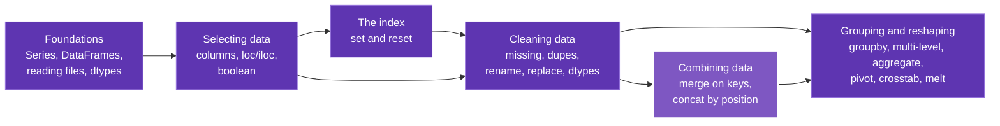

# Pandas

Welcome. This is not another cheat sheet, and it is not the official docs either.

Most pandas resources fall into one of two traps. The beginner ones show you *what* to type but never *why* it works, so the moment something breaks you are stuck. The advanced ones (looking at you, official docs) are technically perfect and completely unwelcoming if you are still learning the basics. This site tries to sit in the middle: explain every concept as **what it is, how it works, and why it behaves that way**, with pictures, plain language, and the connections between ideas made obvious instead of left for you to work out alone.

Think of it like a good friend who happens to know pandas really well, sitting next to you, drawing on a whiteboard.

!!! intuition "How to read this site"
    Every concept page is layered. Skim the **intuition** box at the top if you just need the gist. Read the **how it works** section to actually use it. Drop into **under the hood** when you want to know why pandas does the strange thing it does. You never have to read all of it at once. Every code example here is verified against **pandas 3.0**.

## The map

Pandas looks like a hundred unrelated methods. It is really a handful of ideas that keep showing up, and they build on each other left to right.

Start at **Foundations** to learn what a Series and a DataFrame even are, move through **Selecting** and **Cleaning**, **combine** separate tables with merge, and finish with **Grouping**, where you answer real "per category" questions. Each chapter ends by linking to the ones it leans on, so you can follow the threads in any direction. The highlighted node is the newest chapter.

## Where to begin

**New to pandas? Start with Foundations and read top to bottom.** Each chapter builds on the one before it. Already comfortable with the basics? Jump straight to whichever section you need.

-   :material-cube-outline:{ .lg .middle } **Foundations**

    ---

    What a Series and a DataFrame really are, how to inspect one, and the data types that decide everything.

    [:octicons-arrow-right-24: Start here](foundations/series.md)

-   :material-target:{ .lg .middle } **Selecting data**

    ---

    Point at the exact rows and columns you mean: by label, by position, and by condition.

    [:octicons-arrow-right-24: loc and iloc](selection/loc-iloc.md)

-   :material-broom:{ .lg .middle } **Cleaning data**

    ---

    Handle missing values, drop duplicates, rename, replace, and fix wrong types.

    [:octicons-arrow-right-24: Missing values](cleaning/missing-values.md)

-   :material-chart-bar:{ .lg .middle } **Grouping and reshaping**

    ---

    Split, apply, combine. Answer "per region" and "per month" questions and pivot the results into a grid.

    [:octicons-arrow-right-24: GroupBy](grouping/groupby.md)

-   :material-call-merge:{ .lg .middle } **Combining data**

    ---

    Join two tables on a shared key with merge, or stack same-shape tables together with concat.

    [:octicons-arrow-right-24: Merge DataFrames](combining/merge.md)

