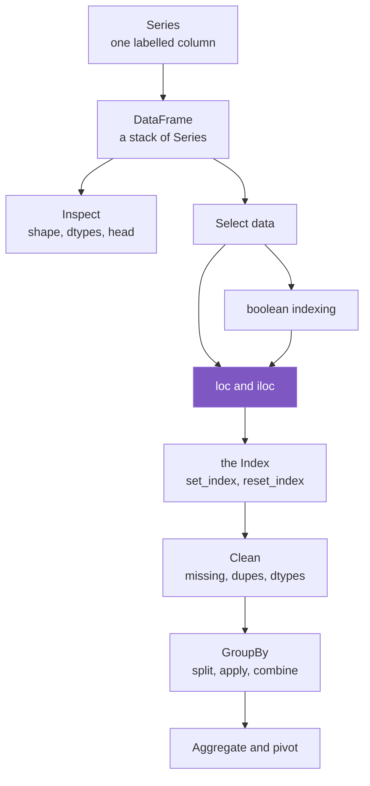

# Pandas, Properly

Welcome. This is not another cheat sheet, and it is not the official docs either.

Most pandas resources fall into one of two traps. The beginner ones show you *what* to type but never *why* it works, so the moment something breaks you are stuck. The advanced ones (looking at you, official docs) are technically perfect and completely unwelcoming if you are still finding your feet. This site tries to live in the middle: explain every concept as **what it is, how it works, and why it behaves that way**, with pictures, plain language, and the connections between ideas made obvious instead of left for you to discover the hard way.

Think of it like a good friend who happens to know pandas really well, sitting next to you, drawing on a whiteboard.

!!! intuition "How to read this site"
    Every concept page is layered. Skim the **intuition** box at the top if you just need the gist. Read the **how it works** section to actually use it. Drop into **under the hood** when you want to know why pandas does the strange thing it does. You never have to read all of it at once.

## The map

Pandas looks like a hundred unrelated methods. It is really a small number of ideas that keep showing up. Here is the lay of the land, and how the pieces lean on each other.

The highlighted box, **loc and iloc**, is where we start. It is the doorway to almost everything else: filtering, cleaning, and grouping all stand on top of knowing how to point at the exact rows and columns you mean.

## Start here

-   :material-target:{ .lg .middle } **loc and iloc**

    ---

    The two ways to point at data: by *label* and by *position*. Get this right and half of pandas stops being scary.

    [:octicons-arrow-right-24: Read it](selection/loc-iloc.md)

More chapters are on the way. Each one will plug into this same map.
